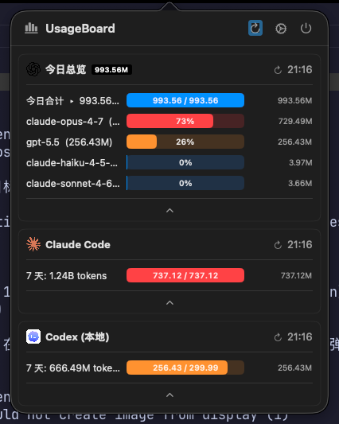
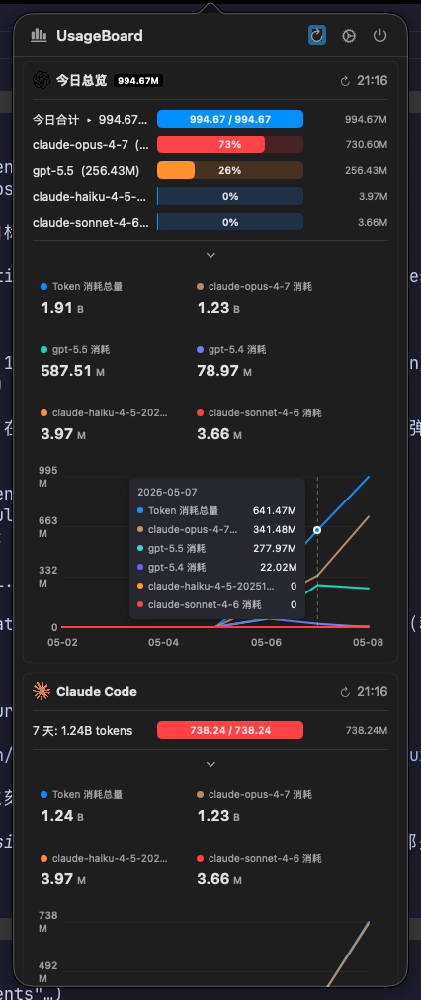
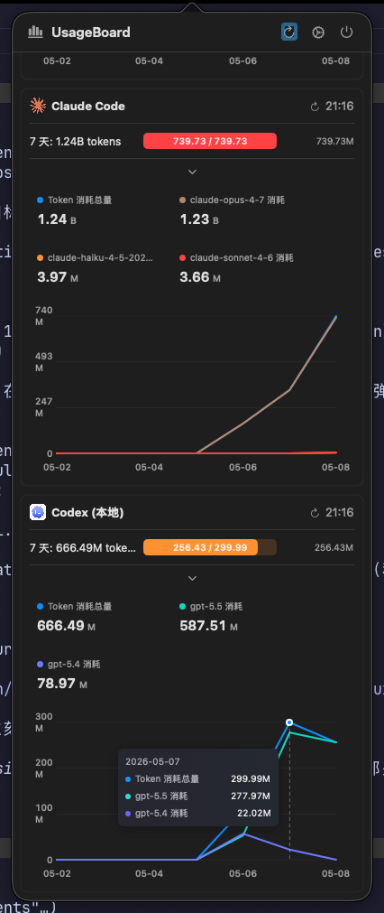

# TokenUsed

> 为 [UsageBoard](https://github.com/marsmay/UsageBoard) 打造的本地 token 用量插件集——把 **Claude Code / Gemini CLI / Codex CLI** 三家命令行工具的本地会话聚合到 macOS 菜单栏面板。

简体中文 · [English](./README.md)

[](./LICENSE) 

<p align="center">
  <br>
  <sub>用量总览（hero 合计 + 各模型行 + 右列 token 数）与单 CLI 面板</sub>
</p>

<details>
<summary>📊 点开看 7 天图表展开形态</summary>

<p align="center">
  
  <br>
  <sub>点 panel 底部的箭头展开按模型堆叠的 7 天柱状图</sub>
</p>

</details>

---

## ✨ 特性

- **不依赖任何远程 API**——完全离线读本地 JSONL/JSON 会话文件，**不需要 ChatGPT 订阅 token**。
- **三家 CLI 一个面板**——Claude Code / Gemini CLI / Codex CLI 用量按模型聚合。
- **用量总览 + 多周期图表**——hero 大数字显示所选周期合计，下方堆叠图按模型分段；支持 `today` / `7d` / `30d` / `90d` / `all`。
- **总览行更清爽**——用量总览只展开 Top 5 模型，其余折叠为 `其他`，模型行会尽量标出来源/provider。
- **token 口径更清楚**——Claude 支持 `billable` / `raw` 两种口径，Codex/Gemini 保持各自上报 token 语义。
- **安装辅助 CLI**——`tokenused doctor`、`sync-plugins`、`install-config`、`smoke` 让安装和排错可重复。
- **空数据自动隐藏**——某 CLI 从没用过（如 Gemini），它的 panel 自动消失。
- **右侧列直接显示 token 数**——通过 `trailingText` 字段把 UsageBoard 原本"重置时间"那一列改用为按行显示模型 token 数。
- **附带原生 macOS WidgetKit 项目**——`widget/` 下代码完整；上桌面 widget gallery 需要付费 Apple Developer Program（详见[原生 widget 状态](#原生-widget-状态)）。

---

## 📋 依赖

| 组件 | 版本 | 说明 |
|---|---|---|
| macOS | 13.0 + | UsageBoard 自身要求 |
| Python 3 | 3.8 + | 系统自带或 Homebrew 都行 |
| [UsageBoard](https://github.com/marsmay/UsageBoard) | 上游 `main` | 会用本仓库 patch 做本地构建 |
| Swift toolchain | 6.2 + | 仅本地构建 UsageBoard 时需要 |
| Xcode 16 + | 可选 | 仅当你也想构建原生 widget app 时需要 |

数据源至少需要其中**一个** CLI 已经产生过会话：

- Claude Code → `~/.claude/projects/**/*.jsonl`
- Gemini CLI → `~/.gemini/tmp/**/session-*.json`
- Codex CLI → `~/.codex/sessions/**/*.jsonl` 及 `~/.codex/archived_sessions/*.jsonl`

没数据的 CLI 自动隐藏——四个插件全装即可，有什么数据就显示什么。

---

## 🚀 快速开始

### 🍺 路径 A：Homebrew（推荐）

```bash
brew tap unistark/tap
brew install tokenused
```

插件会装到 `$(brew --prefix)/opt/tokenused/share/tokenused/`，辅助 CLI 会作为 `tokenused` 可用。

Homebrew 后的最短路径：

```bash
# 1. 检查依赖和路径
tokenused doctor

# 2. 给 UsageBoard 打补丁并本地构建（一次性）
git clone https://github.com/marsmay/UsageBoard.git ../UsageBoard
cd ../UsageBoard
git apply "$(brew --prefix)/opt/tokenused/share/tokenused/patches/usageboard-build-and-refresh.patch"
bash scripts/build.sh
cd -

# 3. 拷贝/更新 TokenUsed 插件到 UsageBoard
tokenused sync-plugins

# 4. 把 TokenUsed 配置 merge/upsert 到 UsageBoard，不删除其他插件
tokenused install-config

# 5. 跑已安装插件的 smoke 检查
tokenused smoke
```

`brew info tokenused` 也会打印激活说明。

### 🛠️ 路径 B：手动

```bash
# 1. 克隆
git clone https://github.com/uniStark/TokenUsed.git
cd TokenUsed

# 2. 拉 UsageBoard，应用补丁，本地构建（一次性）
git clone https://github.com/marsmay/UsageBoard.git ../UsageBoard
cd ../UsageBoard
git apply ../TokenUsed/patches/usageboard-build-and-refresh.patch
bash scripts/build.sh
cd ../TokenUsed

# 3. 检查依赖和路径
python3 bin/tokenused doctor

# 4. 拷贝/更新 TokenUsed 插件到 UsageBoard
python3 bin/tokenused sync-plugins

# 5. 把 TokenUsed 配置 merge/upsert 到 UsageBoard，不删除其他插件
python3 bin/tokenused install-config

# 6. 跑已安装插件的 smoke 检查
python3 bin/tokenused smoke

# 7. 打开 UsageBoard，点菜单栏图标，应该看到总览 + 单 CLI 面板
```

遇到问题见下文 [排错](#排错)。

### 不使用辅助 CLI 的手动兜底

如果暂时不能用 `bin/tokenused`，旧的手动安装路径仍可用：

```bash
mkdir -p "$HOME/Library/Application Support/UsageBoard/plugins"
cp plugins/*.py "$HOME/Library/Application Support/UsageBoard/plugins/"
chmod +x "$HOME/Library/Application Support/UsageBoard/plugins/"*.py
sed "s|__HOME__|$HOME|g" examples/config.example.json > "$HOME/Library/Application Support/UsageBoard/config.json"
```

能用时优先跑 `tokenused install-config`，因为它会 merge/upsert TokenUsed 插件项，而不是替换整个 UsageBoard 配置。

---

## 🩹 补丁修改了什么

`patches/usageboard-build-and-refresh.patch` 给上游 UsageBoard 做了几处小改：

| 文件 | 修改 | 原因 |
|---|---|---|
| `Package.swift` | `swift-tools-version: 6.3` → `6.2` | 让 Swift 6.2 toolchain 能构建 |
| `Sources/UsageBoardApp/DashboardView.swift` | `.onAppear` 加 `store.refreshAll()`，加 `visiblePlugins`，加面板内 segmented period picker，并调整长标题 / badge 布局 | 每次开面板自动刷新；空数据 CLI 自动隐藏；周期切换不重跑插件；长模型名和大数字不被截断 |
| `Sources/UsageBoardCore/Models.swift` | `PluginOutput` / `PluginSnapshot` / `PluginCachedState` 支持 `dimensions`、`defaultDimension`、`dimensionOrder`、`iconURL`，`UsageItem` 支持 `trailingText` | 让插件一次输出多周期数据；允许插件动态覆盖图标；右列显示 token 数 |
| `Sources/UsageBoardCore/PluginExecutor.swift` | 默认 timeout `15s` → `180s`，并优先使用 plugin 输出的 `iconURL` | 冷启动扫描大目录时不易超时；用量总览可显示当前主导 provider 图标 |

如果你坚持用未打补丁的 UsageBoard，插件依然能跑——只是失去自动隐藏、右列 token 数、面板内多周期切换和动态图标等增强。

---

## 🧰 CLI 命令参考

Homebrew 安装后使用 `tokenused <command>`；手动 clone 后在仓库内使用 `python3 bin/tokenused <command>`。

| 命令 | 作用 |
|---|---|
| `doctor` | 检查 Python、UsageBoard 路径、插件/配置位置、会话数据可见性，以及常见 patch/install 问题。面板空白或数据不刷新时先跑它。 |
| `sync-plugins` | 把 TokenUsed 插件脚本复制/更新到 `~/Library/Application Support/UsageBoard/plugins/`，并设置可执行权限。 |
| `install-config` | 把 TokenUsed 插件项 merge/upsert 到 UsageBoard `config.json`；不应删除其他 UsageBoard 插件或用户设置。 |
| `smoke` | 对已安装插件做轻量检查，打开 UsageBoard 前先发现 JSON/schema/runtime 错误。 |

这个 CLI 只负责让 TokenUsed 安装更稳。UsageBoard patch 仍是增强体验的关键：未打补丁时插件可运行，但多周期切换、右列 token 数、空数据隐藏、布局修正和动态图标会降级或不可用。

---

## ⚙️ 配置

四个插件的所有参数都从 UsageBoard 设置面板读取，默认值开箱即用。需要时再覆写。

### 用量总览 (`daily-overview-plugin.py`)

| 参数 | 默认 | 说明 |
|---|---|---|
| `CLAUDE_DIR` | `~/.claude/projects` | Claude Code 会话 JSONL 目录 |
| `GEMINI_DIR` | `~/.gemini/tmp` | Gemini CLI `session-*.json` 目录 |
| `CODEX_DIR` | `~/.codex` | Codex CLI 根目录（扫 `sessions/` + `archived_sessions/`） |
| `CHART_PERIOD` | `30d` | 默认周期：`today` / `7d` / `30d` / `90d` / `all`（12 个月），图表桶自适应：day → week（90d） → month（all） |
| `TOKEN_MODE` | `billable` | `billable`（input+output+cache_creation，与 Claude Code `/cost` 一致）或 `raw`（再加上 `cache_read_input_tokens` 命中——通常占总量 ~95%） |

### 单 CLI 插件（`claude-code-usage-plugin.py`、`gemini-cli-usage-plugin.py`、`codex-local-usage-plugin.py`）

| 参数 | 默认 | 说明 |
|---|---|---|
| `*_DIR` | 同上 | 覆盖该 CLI 的扫描路径 |
| `STAT_PERIOD` | `30d` | 默认周期：`today` / `7d` / `30d` / `90d` / `all` |
| `TOKEN_MODE`（仅 Claude） | `billable` | 同用量总览。对 Codex/Gemini 面板无效（它们的 token 报告里没有 cache_read 概念） |

> **面板内 segmented 切换**：每个 plugin 输出 `dimensions` 字段含全部 5 个 period 的预算数据，所以首次扫描完缓存后（~30s），点 `今日 ↔ 7d ↔ 30d ↔ 90d ↔ 全部` 立即切换——无需 spawn plugin、无需重 parse。选择通过 `@AppStorage("usageboard.period.<pluginID>")` 按 plugin 持久化。

> **为什么有两种口径？** Claude 的 `usage` 把每次 prompt cache 命中都按 `cache_read_input_tokens` 计入。tool 用得多时 raw 总数会比真正按账单算的高 100×+。`billable` 对齐 Anthropic 计费四件套（`input + output + cache_creation`）；切换只在 cache 内做投影，不会触发重 parse。

> **总览模型行**：用量总览展示所选周期 Top 5 模型，其余模型折叠为 `其他`。模型名会尽量保留来源数据里的具体名称；可判断来源时，会在行内尽量补上来源/provider 提示。

自定义路径：UsageBoard → 菜单栏图标 → 齿轮 → **插件** → 点插件 → 调参数。无需重启。

### 进度条配色含义

四个插件的进度条**颜色规则不一样**，是设计如此：
- **用量总览**：颜色按"该模型占今日总量的百分比"——红≥50%、橙≥25%、蓝<25%
- **单 CLI**：颜色按"今天用量 ÷ 期内峰值日"——红≥100%（破峰）、橙≥80%、蓝<80%

---

## 📁 仓库结构

```
TokenUsed/
├── bin/
│   └── tokenused                         # 安装/排错辅助 CLI
├── plugins/                            # UsageBoard Python 插件
│   ├── daily-overview-plugin.py        # ⭐ 用量总览（三家聚合，按模型分行 + 7 天柱状图）
│   ├── claude-code-usage-plugin.py     # Claude Code 单独面板
│   ├── gemini-cli-usage-plugin.py      # Gemini CLI 单独面板
│   ├── codex-local-usage-plugin.py     # Codex CLI 单独面板
│   ├── _shared.py                      # 兼容门面：插件入口继续从这里 import
│   └── _shared_*.py                    # 私有共享模块（core/cache/parsers/builders）
├── patches/
│   └── usageboard-build-and-refresh.patch  # UsageBoard UI / schema / executor 增强补丁
├── examples/
│   └── config.example.json             # 已注册四个插件的 UsageBoard 完整配置
├── widget/                             # 原生 macOS WidgetKit 应用（Xcode 项目，见状态说明）
├── images/                             # README 截图
├── README.md                           # 英文文档
├── README_ZH.md                        # 中文文档（本文件）
└── LICENSE                             # MIT
```

---

## 🍎 原生 Widget 状态

`widget/` 下是一个完整的 WidgetKit + SwiftUI Xcode 项目（Small / Medium / Large 三尺寸，Swift Charts 7 天柱状图）。本地能 build 能跑，但 **macOS 15+ Sequoia / Tahoe** 的系统 daemon `chronod` 拒绝把 Personal Team 签的 widget extension 加进桌面 widget gallery——**需要付费 [Apple Developer Program](https://developer.apple.com/programs/)（$99/年）**才能真正用上。

不打算付费的话，菜单栏的 UsageBoard 面板已经覆盖所有数据。widget 代码已就绪，等签名通路打开即可发布。

---

## 📊 数据来源

| 插件 | 读取位置 | 字段 |
|---|---|---|
| Claude Code | `~/.claude/projects/**/*.jsonl` | `message.usage.{input,output,cache_*}_tokens` + `message.model` |
| Gemini CLI | `~/.gemini/tmp/**/session-*.json` | `messages[].tokens.total` + `messages[].model` |
| Codex CLI | `~/.codex/sessions/**/*.jsonl` + `archived_sessions/*.jsonl` | `payload.info.total_token_usage.total_tokens`（按相邻 `turn_context` 取 model） |

总览插件并行读取以上三处。

---

## 🐛 排错

**先跑 `tokenused doctor`**：它会集中检查最常见的失败点：
```bash
tokenused doctor
# 或者手动 clone 后：
python3 bin/tokenused doctor
```
根据输出确认问题是 UsageBoard 路径缺失、没有本地会话数据、插件未同步、配置未合并，还是 UsageBoard 未打补丁。

**Panel 显示 "JSON 解析失败"**：手动跑插件看原始报错：
```bash
python3 "$HOME/Library/Application Support/UsageBoard/plugins/daily-overview-plugin.py" \
  --usageboard-param USAGEBOARD_LANGUAGE=zh-Hans
```

也可以跑 `tokenused smoke`，通过辅助 CLI 检查已安装插件。

**构建报 `swift-tools-version 6.3 is not supported`**：你忘了打补丁。`cd UsageBoard && git apply ../TokenUsed/patches/usageboard-build-and-refresh.patch`。

**右列显示 `--`**：你跑的是未打补丁的 UsageBoard。`trailingText` 字段需要补丁。

**Gemini 面板还显示 `0 tokens`**：UsageBoard 没打补丁，或者 Gemini 插件还是改前的版本——`cp plugins/gemini-cli-usage-plugin.py ~/Library/Application\ Support/UsageBoard/plugins/` 然后点菜单栏图标刷新。

---

## 🤝 贡献

欢迎 PR。可以折腾的方向：

- 新增 CLI 插件（例如 Aider、Cursor CLI、Cline、OpenRouter）——拷一个现有 `*-usage-plugin.py` 当模板，遵循 `# UsageBoardPlugin: ... # /UsageBoardPlugin` 元数据块即可。
- 调整配色/阈值规则——当前规则在 [配置](#配置) 章节。
- 原生 widget 收尾——一旦 Apple Developer Program 问题解决，`widget/` 已经准备好可分发。
- 除 `zh-Hans` / `en` 之外的本地化。

提交前请跑一次 `python3 plugins/<你的插件>.py --usageboard-param USAGEBOARD_LANGUAGE=en` 确认输出符合现有 schema。

本地跑一遍测试（CI 也跑这套）：

```bash
python3 -m unittest tests.test_plugins -v
```

### 🛠 维护者——重新生成 patch

`patches/usageboard-build-and-refresh.patch` 是真正的 `git diff`，必须一直保持是合法的 unified diff。如果你在 Claude Code 里装了 [RTK (Rust Token Killer)](https://github.com/uniStark/rtk)，它的 hook 会拦截 `git diff` / `git status` 等命令，把输出压缩成省 token 的伪格式——**这种格式不是合法的 unified diff**，`git apply` 会报 `No valid patches in input`。正确重生成方式：

```bash
cd ../UsageBoard
# 用 rtk proxy 绕过 hook，让 git 输出原生 unified diff
rtk proxy git diff > ../TokenUsed/patches/usageboard-build-and-refresh.patch
# 在 clean working tree 上验证
git stash && git apply --check ../TokenUsed/patches/usageboard-build-and-refresh.patch && git stash pop
```

CI (`.github/workflows/ci.yml`) 在每次 push 都跑 `git apply --check` 和补丁后的 `swift build`，patch 一旦坏掉或编译失败会直接挂 CI，避免坏 patch 流到 main。

---

## 📄 许可

MIT，见 [LICENSE](./LICENSE)。插件脚本可自由修改与再分发。

## 🙏 致谢

- [UsageBoard](https://github.com/marsmay/UsageBoard) —— 本项目挂靠的菜单栏宿主。
- [lobe-icons](https://github.com/lobehub/lobe-icons) —— `examples/config.example.json` 引用的插件图标集。
